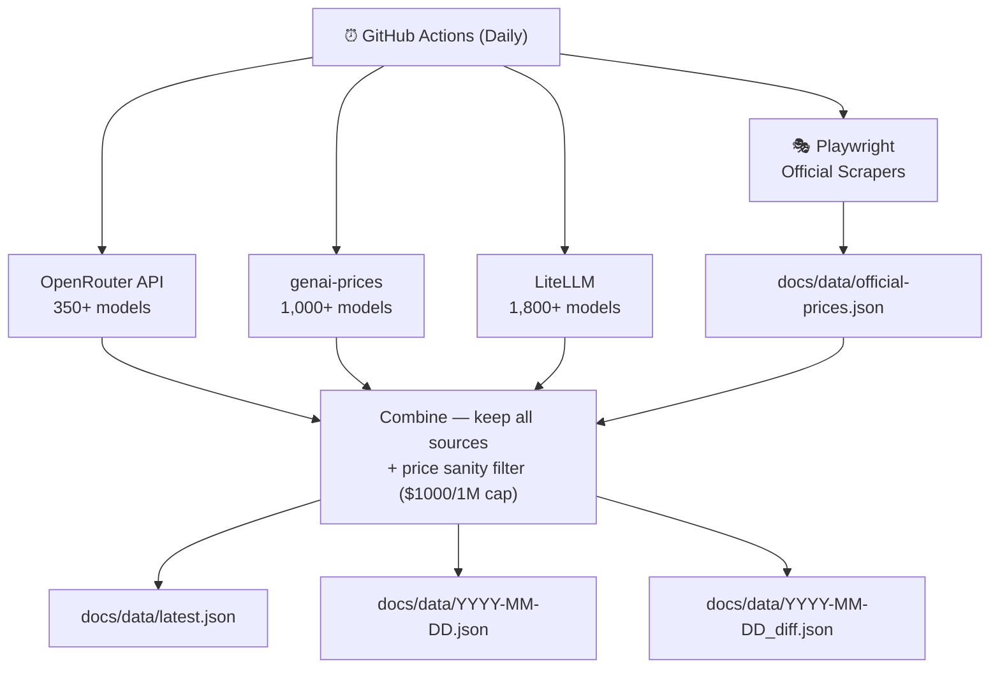

<p align="center">
  <h1 align="center">AI Model Price Tracker</h1>
  <p align="center">
    Automated daily tracker for AI model pricing across 100+ providers.
    <br />
    <a href="https://ai-model-price-tracker.github.io/ai-model-price-tracker/"><strong>Live Dashboard »</strong></a>
    <br />
    <br />
    <a href="https://ai-model-price-tracker.github.io/ai-model-price-tracker/data/latest.json">JSON API</a>
    ·
    <a href="https://github.com/ai-model-price-tracker/ai-model-price-tracker/issues">Report Incorrect Price</a>
    ·
    <a href="https://github.com/ai-model-price-tracker/ai-model-price-tracker/issues">Request Provider</a>
  </p>
</p>

<p align="center">
  <a href="https://github.com/ai-model-price-tracker/ai-model-price-tracker/actions/workflows/collect-prices.yml"></a>
  <a href="https://ai-model-price-tracker.github.io/ai-model-price-tracker/"></a>
  
  <br>
  <a href="https://github.com/ai-model-price-tracker/ai-model-price-tracker/stargazers"></a>
  <a href="https://github.com/ai-model-price-tracker/ai-model-price-tracker/issues"></a>
  
</p>

> **Disclaimer:** This project is for informational purposes only. Pricing data is collected from third-party aggregators and official pages via automated scraping. While we strive for accuracy, **prices may be outdated, incomplete, or incorrect**. Always verify on each provider's official pricing page before making decisions. This project is not affiliated with any AI provider.

<p align="center">
  <a href="translations/README.ko.md">한국어</a> · <a href="translations/README.ja.md">日本語</a> · <a href="translations/README.zh-CN.md">中文(简体)</a> · <a href="translations/README.zh-TW.md">中文(繁體)</a> · <a href="translations/README.es.md">Español</a> · <a href="translations/README.fr.md">Français</a> · <a href="translations/README.de.md">Deutsch</a> · <a href="translations/README.pt.md">Português</a> · <a href="translations/README.ru.md">Русский</a>
  <br>
  <a href="translations/README.ar.md">العربية</a> · <a href="translations/README.hi.md">हिन्दी</a> · <a href="translations/README.it.md">Italiano</a> · <a href="translations/README.tr.md">Türkçe</a> · <a href="translations/README.vi.md">Tiếng Việt</a> · <a href="translations/README.th.md">ไทย</a> · <a href="translations/README.id.md">Bahasa Indonesia</a> · <a href="translations/README.nl.md">Nederlands</a> · <a href="translations/README.pl.md">Polski</a>
</p>

---

## Features

- **3,000+ models** from **100+ providers** tracked daily
- **4 data sources** — 3 community APIs + official page scraping via Playwright
- **Official price verification** — scrapes OpenAI, Anthropic, Google, DeepSeek, AWS Bedrock directly
- **Zero-config CI** — runs in Playwright Docker container, no API keys needed
- **Free JSON API** — consume `latest.json` from GitHub Pages in your own projects
- **Interactive dashboard** — search, filter, sort, compare prices with i18n support (18 languages)
- **Failure resilience** — graceful degradation, previous data preserved, auto-issue on failure

## Using the Data

The latest pricing data is freely available as JSON — no installation required:

```bash
curl -s https://ai-model-price-tracker.github.io/ai-model-price-tracker/data/latest.json | jq .summary
```

```javascript
const res = await fetch('https://ai-model-price-tracker.github.io/ai-model-price-tracker/data/latest.json');
const data = await res.json();

// Find all OpenAI models
const openai = data.providers.find(p => p.provider === 'openai');
console.log(openai.models.map(m => `${m.name}: $${m.input_price_per_1m}/1M input`));
```

```python
import requests
data = requests.get('https://ai-model-price-tracker.github.io/ai-model-price-tracker/data/latest.json').json()
for p in data['providers']:
    for m in p['models']:
        if m['input_price_per_1m'] and m['input_price_per_1m'] < 1:
            print(f"{m['name']}: ${m['input_price_per_1m']}/1M input")
```

## For LLMs

You can give an LLM access to real-time AI model pricing by adding this to your system prompt:

```
You have access to AI model pricing data via the following JSON API:
https://ai-model-price-tracker.github.io/ai-model-price-tracker/data/latest.json

The JSON structure is:
- providers[]: array of providers, each with display_name and models[]
- models[]: id, name, input_price_per_1m (USD), output_price_per_1m (USD),
  cached_input_price_per_1m, context_length, supports_vision, supports_function_calling, source
- summary: total_providers, total_models, cheapest_model, most_expensive_model,
  average_input_price_per_1m, average_output_price_per_1m

Use this data to answer questions about AI model pricing, compare costs, and recommend models.
```

## How It Works



## Data Sources

| # | Source | Type | Models | License |
|---|--------|------|--------|---------|
| 1 | Official pages (Playwright) | Web scraping | 200+ | N/A |
| 2 | [OpenRouter API](https://openrouter.ai/api/v1/models) | REST API | 350+ | [ToS](https://openrouter.ai/terms) |
| 3 | [pydantic/genai-prices](https://github.com/pydantic/genai-prices) | JSON (GitHub) | 1,000+ | MIT |
| 4 | [BerriAI/litellm](https://github.com/BerriAI/litellm) | JSON (GitHub) | 1,800+ | MIT |

**No merge:** Each source's data is kept as a separate entry. The same model may appear multiple times with different prices from different sources, allowing users to compare. A daily diff file tracks additions, removals, and price changes.

### Official page scrapers

Each scraper is a separate file under [`scripts/scrapers/`](scripts/scrapers/) for easy maintenance:

| File | Provider | Status |
|------|----------|--------|
| [`anthropic.mjs`](scripts/scrapers/anthropic.mjs) | Anthropic (Claude) | ✅ 3 models |
| [`openai.mjs`](scripts/scrapers/openai.mjs) | OpenAI | ✅ 59 models |
| [`google-gemini.mjs`](scripts/scrapers/google-gemini.mjs) | Google Gemini | ✅ 18 models |
| [`deepseek.mjs`](scripts/scrapers/deepseek.mjs) | DeepSeek | ✅ 2 models |
| [`aws-bedrock.mjs`](scripts/scrapers/aws-bedrock.mjs) | AWS Bedrock | ✅ 164 models |
| [`mistral.mjs`](scripts/scrapers/mistral.mjs) | Mistral | ⚠️ 0 models |
| [`xai.mjs`](scripts/scrapers/xai.mjs) | xAI (Grok) | ⚠️ 0 models |

**Adding a new scraper:** Create a new file in `scripts/scrapers/` exporting `name`, `url`, and `scrape(page)`, then import it in [`scrape-official.mjs`](scripts/scrape-official.mjs).

### Accuracy & limitations

- All sources are **ultimately derived from official documentation**, directly or through third parties
- Prices may be **outdated** — providers can change prices at any time without notice
- Some models may have **incomplete metadata** (missing cache pricing, incorrect capability flags)
- **Free-tier limits, rate limits, and volume discounts** are generally not captured
- Official scraping may break when providers redesign their pricing pages

Found an error? Please [open an issue](https://github.com/ai-model-price-tracker/ai-model-price-tracker/issues) or [submit a PR](https://github.com/ai-model-price-tracker/ai-model-price-tracker/pulls).

## Glossary

| Term | Description |
|------|-------------|
| **Token** | The basic unit AI models use to process text. 1 token ≈ 3/4 of an English word. Prices in this tracker are per 1 million tokens. |
| **Input tokens** | Text/data you send to the model (prompt, context, instructions). |
| **Output tokens** | Text the model generates in response. Typically more expensive than input. |
| **Context window** | Max tokens a model can process in one conversation (input + output combined). |
| **Cached input** | Discounted price when reusing the same prompt prefix across requests. |
| **Batch pricing** | Lower pricing for non-urgent bulk requests processed asynchronously (hours, not seconds). |
| **Function calling** | The model's ability to call external tools or APIs during generation. |
| **Vision** | The model's ability to process and understand image inputs. |

## Collected Data

| Field | Description |
|-------|-------------|
| `input_price_per_1m` | Cost per 1M input tokens (USD) — see [Glossary](#glossary) |
| `output_price_per_1m` | Cost per 1M output tokens (USD) |
| `cached_input_price_per_1m` | Discounted cost per 1M cached input tokens |
| `context_length` | Maximum context window size (in tokens) |
| `supports_vision` | Whether the model can process image inputs |
| `supports_function_calling` | Whether the model can call external tools/functions |
| `source` | Data source (`openrouter`, `genai-prices`, `litellm`, `official`) |

## Tracked Providers

| Provider | Models | Official Pricing |
|----------|--------|-----------------|
| Amazon Bedrock | 455 | [aws.amazon.com/bedrock/pricing](https://aws.amazon.com/bedrock/pricing/) |
| OpenAI | 295 | [platform.openai.com/docs/pricing](https://platform.openai.com/docs/pricing) |
| Fireworks AI | 244 | [fireworks.ai/pricing](https://fireworks.ai/pricing) |
| Azure OpenAI | 137 | [azure.microsoft.com/en-us/pricing/details/azure-openai](https://azure.microsoft.com/en-us/pricing/details/azure-openai/) |
| Google | 126 | [ai.google.dev/gemini-api/docs/pricing](https://ai.google.dev/gemini-api/docs/pricing) |
| Mistral | 109 | [mistral.ai/pricing](https://mistral.ai/pricing) |
| Together AI | 104 | [www.together.ai/pricing](https://www.together.ai/pricing) |
| Anthropic | 85 | [docs.anthropic.com/en/docs/about-claude/models](https://docs.anthropic.com/en/docs/about-claude/models) |
| DeepInfra | 67 | [deepinfra.com/pricing](https://deepinfra.com/pricing) |
| Qwen (Alibaba) | 54 | [help.aliyun.com/zh/model-studio/getting-started/models](https://help.aliyun.com/zh/model-studio/getting-started/models) |
| xAI (Grok) | 52 | [docs.x.ai/docs/models](https://docs.x.ai/docs/models) |
| Groq | 40 | [groq.com/pricing](https://groq.com/pricing) |
| Replicate | 40 | [replicate.com/pricing](https://replicate.com/pricing) |
| Perplexity | 38 | [docs.perplexity.ai/guides/pricing](https://docs.perplexity.ai/guides/pricing) |
| DeepSeek | 27 | [api-docs.deepseek.com/quick_start/pricing](https://api-docs.deepseek.com/quick_start/pricing) |
| Cohere | 17 | [cohere.com/pricing](https://cohere.com/pricing) |
| Meta (Llama) | 17 | [llama.meta.com](https://llama.meta.com/) |
| SambaNova | 16 | [sambanova.ai](https://sambanova.ai/) |
| AI21 Labs | 15 | [www.ai21.com/pricing](https://www.ai21.com/pricing) |
| Cerebras | 11 | [cerebras.ai/pricing](https://cerebras.ai/pricing) |
| NVIDIA | 8 | [build.nvidia.com](https://build.nvidia.com/) |

Plus **100+ additional providers** automatically collected via OpenRouter, genai-prices, and LiteLLM.

## GitHub Actions

| Feature | Details |
|---------|---------|
| **Schedule** | Daily at 06:00 UTC |
| **Manual trigger** | `workflow_dispatch` in Actions tab |
| **Container** | `mcr.microsoft.com/playwright:v1.50.0-noble` |
| **Pipeline** | `scrape` → `collect` → `validate` → `commit` |
| **On failure** | Auto-creates GitHub Issue (`collection-failure` label) |
| **Data safety** | Previous data preserved if all sources fail |

## Self-Hosting

1. **Fork** this repository
2. **Settings > Pages** — Source: `Deploy from a branch`, Branch: `main`, Folder: `/docs`
3. **Settings > Actions > General** — Enable `Read and write permissions`
4. Verify the workflow is enabled in the **Actions** tab
5. (Optional) Trigger manually via **Actions > Collect AI Model Prices > Run workflow**

### Running locally

```bash
git clone https://github.com/ai-model-price-tracker/ai-model-price-tracker.git
cd ai-model-price-tracker
npm install && npx playwright install chromium

npm run scrape      # Scrape official pricing pages
npm run collect     # Collect from APIs + merge scraped data
npm run validate    # Validate output
```

Output: `docs/data/latest.json`, `docs/data/YYYY-MM-DD.json`, `docs/data/YYYY-MM-DD_diff.json`

## Contributing

Contributions are welcome! Here's how you can help:

- **Pricing corrections** — Found a wrong price? [Open an issue](https://github.com/ai-model-price-tracker/ai-model-price-tracker/issues) or submit a PR
- **New scrapers** — Add a scraper for a provider not yet covered ([how to add](#official-page-scrapers))
- **New data sources** — Know of another pricing aggregator? Let us know
- **Dashboard improvements** — UI enhancements, new visualizations, accessibility fixes
- **Missing providers** — Request or add support for new AI providers

See [open issues](https://github.com/ai-model-price-tracker/ai-model-price-tracker/issues) for a list of known tasks.

## License

The **source code** of this project is distributed under the MIT License. See [`LICENSE`](LICENSE) for more information.

> **Data Notice:** The pricing data (JSON files) is aggregated from third-party sources including [OpenRouter](https://openrouter.ai/terms) and official provider pages. Each source is subject to its own terms of service. **The collected data may not be used for commercial purposes** without independently verifying and complying with each original source's terms. See [`LICENSE`](LICENSE) for details.

---

<p align="center">
  Made with GitHub Actions · No API keys required · Updated daily
</p>
